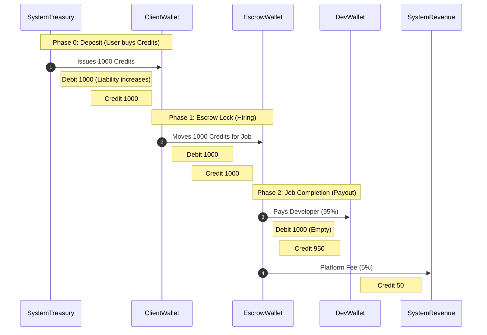

# 🏗️ System Architecture: RoDevsy Platform

> **Version:** 1.1 (Updated Section 5)
> **Status:** Approved
> **Classification:** Confidential / Internal

## 1. Executive Summary
RoDevsy is a **hybrid-cloud financial escrow platform** designed for the Roblox ecosystem. It bridges the trust gap between Developers and Clients by securing funds in a "Zero Trust" ledger until project milestones are cryptographically verified or manually approved.

The architecture strictly separates the **Presentation Layer (Edge)** from the **Financial Core (Private VPC)** to ensure PCI-DSS compliance and maximum security for user funds.

---

## 2. Architectural Principles

1.  **Zero Trust Security:** We assume the network is compromised. Every internal service-to-service call (e.g., API to Database) requires mutual authentication (mTLS) or strict IAM policies.
2.  **Immutability of Ledger:** Financial records (Credits) are **append-only**. We never `UPDATE` a balance row directly without a corresponding `Transaction` audit log entry.
3.  **Contract-Driven Type Safety:** Since the Frontend and Backend live in separate repositories, we enforce type safety via **OpenAPI (Swagger)**. The Backend generates a specification, and the Frontend auto-generates TypeScript clients from that spec, ensuring `rodevsy-web-app` is always in sync with `rodevsy-api-server`.
4.  **Event-Driven Consistency:** Critical but slow operations (e.g., Blockchain confirmations, Email notifications) are decoupled using an asynchronous Message Queue (BullMQ/Redis) to keep the API response time under **100ms**.

---

## 3. High-Level System Context (C4 Level 1)

* **Public Zone (Internet):**
    * **Users:** Access via Web (Desktop/Mobile).
    * **Roblox Game Server:** Communicates via API keys to verify asset ownership.
* **Edge Zone (Vercel):**
    * **Frontend App (`rodevsy-web-app`):** Serves static assets and handles Server-Side Rendering (SSR).
* **Private Zone (AWS VPC):**
    * **API Cluster (`rodevsy-api-server`):** Handles logic.
    * **Worker Cluster:** Handles background jobs.
    * **Persistence:** Databases and File Storage.

---

## 4. Detailed Technology Stack

### 4.1. Repository Structure (Polyrepo)
The system is split into two distinct repositories to decouple deployment cycles and allow independent scaling.

* **`rodevsy-api-server` (Backend):** Contains the NestJS source, Prisma schemas, and Docker configurations.
* **`rodevsy-web-app` (Frontend):** Contains the Next.js source, UI components, and E2E tests.

**Synchronization Strategy:**
* The Backend exposes a `/api-json` (Swagger) endpoint.
* The Frontend utilizes a codegen tool (e.g., `orval` or `openapi-typescript`) to generate strict TypeScript interfaces and API hooks based on the Backend's live specification.

### 4.2. Layer 1: Presentation (Frontend)
**Repository:** `rodevsy-web-app`
**Host:** Vercel

| Component         | Technology                   | Reasoning                                                                                                                                  |
| :---------------- | :--------------------------- | :----------------------------------------------------------------------------------------------------------------------------------------- |
| **Framework**     | **Next.js 14+ (App Router)** | Best-in-class SSR and SEO. React Server Components (RSC) reduce bundle size.                                                               |
| **Language**      | **TypeScript**               | Strict typing prevents `undefined` runtime errors.                                                                                         |
| **UI Library**    | **shadcn/ui**                | Built on **Radix Primitives**. Guarantees WCAG 2.1 compliance (Screen reader support, Keyboard nav) which is legally required for Fintech. |
| **Styling**       | **Tailwind CSS**             | Atomic CSS for rapid development and low CSS bundle size.                                                                                  |
| **State**         | **Zustand**                  | Minimalist client-state (Auth User, UI Toggles).                                                                                           |
| **Data Fetching** | **TanStack Query**           | Handles caching, deduplication, and "stale-while-revalidate" logic for Wallet Balances.                                                    |
| **Validation**    | **Zod**                      | Schema validation for forms *before* network requests.                                                                                     |
| **Testing**       | **Vitest**                   | Native Vite integration; runs 5x faster than Jest for React components.                                                                    |

### 4.3. Layer 2: API & Business Logic (Backend)
**Repository:** `rodevsy-api-server`
**Host:** AWS ECS (Fargate) or App Runner

| Component        | Technology                    | Reasoning                                                                                             |
| :--------------- | :---------------------------- | :---------------------------------------------------------------------------------------------------- |
| **Framework**    | **NestJS**                    | Modular architecture (Modules, Guards, Interceptors) enforces clean code.                             |
| **HTTP Adapter** | **Fastify**                   | **Crucial:** Processes ~30k req/sec (vs Express ~15k). Low overhead for high-frequency trading logic. |
| **Lang**         | **Node.js 20 (LTS)**          | Stable, widely supported runtime.                                                                     |
| **Real-time**    | **Socket.io + Redis Adapter** | Powers the "Dispute Chat" across multiple server instances.                                           |
| **Logging**      | **Pino**                      | Asynchronous, structured JSON logging. Essential for high-load systems.                               |
| **Queue**        | **BullMQ (Redis)**            | Offloads email sending and blockchain polling to background workers.                                  |
| **Security**     | **Helmet / Throttler**        | Auto-sets HSTS headers; Distributed Rate Limiting to stop DDoS.                                       |
| **Testing**      | **Jest**                      | Deep integration with NestJS Dependency Injection for mocking services.                               |

### 4.4. Layer 3: Data Persistence (The Vault)
**Location:** AWS Private Subnets

| Component        | Technology                 | Reasoning                                                                                                                     |
| :--------------- | :------------------------- | :---------------------------------------------------------------------------------------------------------------------------- |
| **Primary DB**   | **PostgreSQL 16 (Aurora)** | ACID Compliance is non-negotiable for financial ledgers. JSONB support allows flexible "Asset Metadata".                      |
| **ORM**          | **Prisma**                 | Type-safe queries. **Note:** Must use `Prisma Accelerate` or AWS RDS Proxy for connection pooling in serverless environments. |
| **Cache**        | **Redis 7 (ElastiCache)**  | Caches User Sessions, Rate Limits, and temporary Chat History.                                                                |
| **Object Store** | **AWS S3**                 | Stores Game Assets (`.rbxm`) and Dispute Evidence images.                                                                     |

---
## 5. Critical Architecture Designs

### 5.1. The "Double-Entry" Ledger System
We strictly enforce **Double-Entry Accounting Principles**. Every financial event must consist of at least two entries: a debit to one account and a credit to another. The sum of all debits must equal the sum of all credits ($\sum Debits = \sum Credits$).

**Core Rules:**
1.  **Integer Precision:** All monetary values are stored as `BigInt`. The base unit is **1 Credit**. There are **no decimals** anywhere in the database to prevent floating-point rounding errors.
2.  **Immutability:** We never `UPDATE` a transaction history. We only insert new corrective transactions.
3.  **Snapshotting:** The `Wallet` model holds a "Current Balance" for fast reads (caching), but the ultimate source of truth is the sum of all `LedgerLines` associated with that wallet.

#### Database Schema (Prisma)
```typescript
// --------------------------------------
// Financial Core
// --------------------------------------

/**
 * Represents a container for value.
 * Types: 
 * - USER: A standard user's available funds.
 * - SYSTEM_TREASURY: The platform's cold wallet (Liability to users).
 * - SYSTEM_REVENUE: The platform's earnings (Fees).
 * - ESCROW: Temporary holding wallet specific to a Project/Job.
 */
model Wallet {
  id        String     @id @default(uuid())
  userId    String?    // Null if System/Escrow wallet
  type      WalletType // USER | SYSTEM_TREASURY | SYSTEM_REVENUE | ESCROW
  currency  String     @default("CREDIT")
  
  // The 'Cache' - Updated atomically via DB Triggers or Transaction Blocks
  balance   BigInt     @default(0) 
  
  // Optimistic Concurrency Control
  version   Int        @default(0) 

  ledgerLines LedgerLine[]
  @@index([userId])
}

/**
 * The "Header" for a financial event. 
 * Groups the individual debit/credit lines.
 */
model Transaction {
  id          String   @id @default(uuid())
  referenceId String   // e.g., "stripe_ch_123" or "project_uuid_456"
  type        TxType   // DEPOSIT | ESCROW_LOCK | ESCROW_RELEASE | WITHDRAWAL
  metadata    Json?    // Context: { "projectId": "...", "reason": "..." }
  createdAt   DateTime @default(now())

  lines       LedgerLine[]
}

/**
 * The atomic movement of funds.
 * For every Transaction, the sum of 'amount' across all lines MUST be 0.
 * (Positive for Credit/Increase, Negative for Debit/Decrease)
 */
model LedgerLine {
  id            String      @id @default(uuid())
  transactionId String
  walletId      String
  amount        BigInt      // e.g., +100 or -100
  
  transaction   Transaction @relation(fields: [transactionId], references: [id])
  wallet        Wallet      @relation(fields: [walletId], references: [id])
}

enum WalletType {
  USER
  SYSTEM_TREASURY
  SYSTEM_REVENUE
  ESCROW
}

enum TxType {
  DEPOSIT
  ESCROW_LOCK
  ESCROW_RELEASE
  WITHDRAWAL
  ADJUSTMENT
}
```

### 5.2. Financial Lifecycle Workflows
The following workflows illustrate how data moves through the ledger during user operations.

#### Visual Flow (Mermaid)


#### A. The Deposit (USDT $\to$ Credits)
When the external blockchain listener confirms a USDT transfer, we mint credits.
* **Trigger:** Blockchain confirmation webhook.
* **Action:**
    1.  **Debit:** `SYSTEM_TREASURY` (Platform Liability increases).
    2.  **Credit:** `USER_WALLET` (User Balance increases).
* **Math:** Treasury $(-1000)$ + User $(+1000) = 0$.

#### B. The Escrow Lock (Hiring a Developer)
When a Client accepts an applicant, funds move to a safe, neutral wallet.
* **Trigger:** Client clicks "Hire".
* **Action:**
    1.  **Debit:** `CLIENT_WALLET` (User funds decrease).
    2.  **Credit:** `ESCROW_WALLET` (Specific to this Project ID).
* **Note:** The Developer does *not* have the money yet. The Client *cannot* spend this money elsewhere.

#### C. The Completion (Work Approved)
The Client reviews the `.rbxm` assets and approves the milestone.
* **Trigger:** Client clicks "Approve Work".
* **Action:**
    1.  **Debit:** `ESCROW_WALLET` (Funds leave the holding state).
    2.  **Credit:** `DEV_WALLET` (Developer gets paid).
    3.  *(Optional)* **Credit:** `SYSTEM_REVENUE` (Platform fee, e.g., 5%).
* **Math:** Escrow $(-1000)$ + Dev $(+950)$ + Revenue $(+50) = 0$.

#### D. The Withdrawal (Credits $\to$ USDT)
The Developer requests a payout.
* **Trigger:** User Request API.
* **Phase 1 (Internal Lock):**
    1.  **Debit:** `DEV_WALLET`.
    2.  **Credit:** `SYSTEM_TREASURY`.
    * *Result:* User balance drops immediately so they cannot double-withdraw.
* **Phase 2 (External Execution):**
    * The `Worker Cluster` picks up the job, interacts with the Blockchain API to send USDT.
    * **If Success:** Transaction finalized.
    * **If Fail:** Reverse Phase 1 (Refund the user via `ADJUSTMENT` transaction).

### 5.3. Concurrency & Race Condition Prevention
In a financial system, two requests may happen simultaneously (e.g., a user clicks "Hire" twice rapidly).

1.  **Optimistic Locking:**
    Every `Wallet` update must include the version check.
    ```sql
    UPDATE "Wallet" 
    SET balance = balance - 100, version = version + 1
    WHERE id = 'wallet_123' AND version = 5;
    ```
    If the version has changed (meaning another transaction processed first), the database returns 0 rows affected. The API throws a `409 Conflict`, and the frontend automatically retries with the new data.

2.  **Idempotency Keys:**
    For sensitive POST requests (Deposit Webhooks, Withdrawals), the client **must** send an `Idempotency-Key` header.
    * **Middleware Logic:** Check Redis. 
        * If Key exists $\to$ Return previous response immediately (do not process logic). 
        * If Key is new $\to$ Process and store result in Redis for 24h.

### 5.4. Security & Validation
1.  **Negative Balance Constraints:**
    Database constraints (`CHECK (balance >= 0)`) are added to `USER_WALLET`s. It is physically impossible for the database to commit a transaction that puts a user in debt.
2.  **Webhook Signatures:**
    All deposit notifications from the Blockchain provider must have their HMAC signatures verified before entering the `Transaction` table.

generate git commit -m "Update architecture.md (#12)" -m "Updated Section 5 with detailed ledger system and workflows."